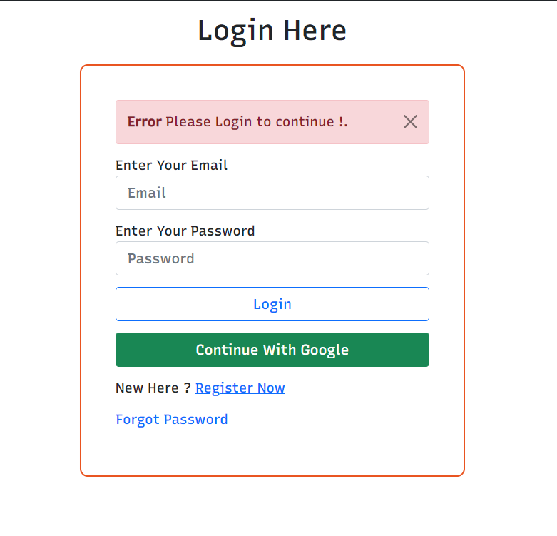
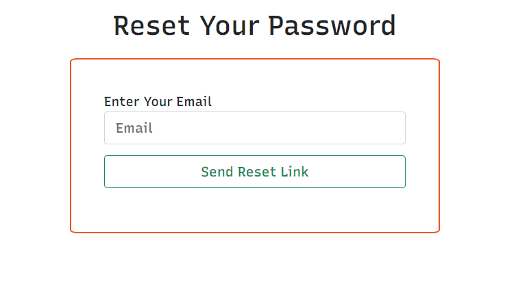
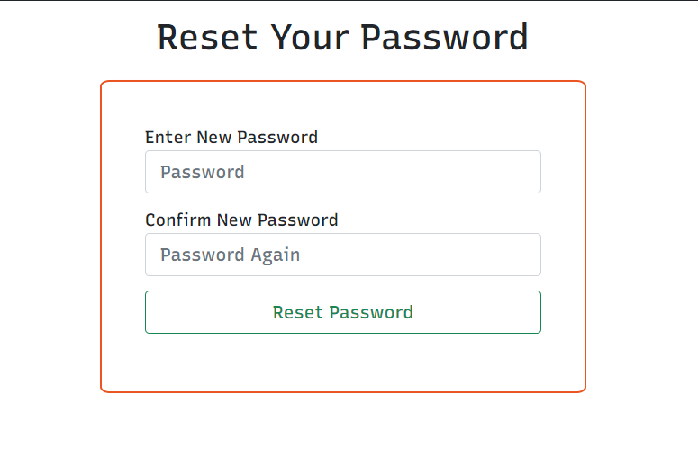
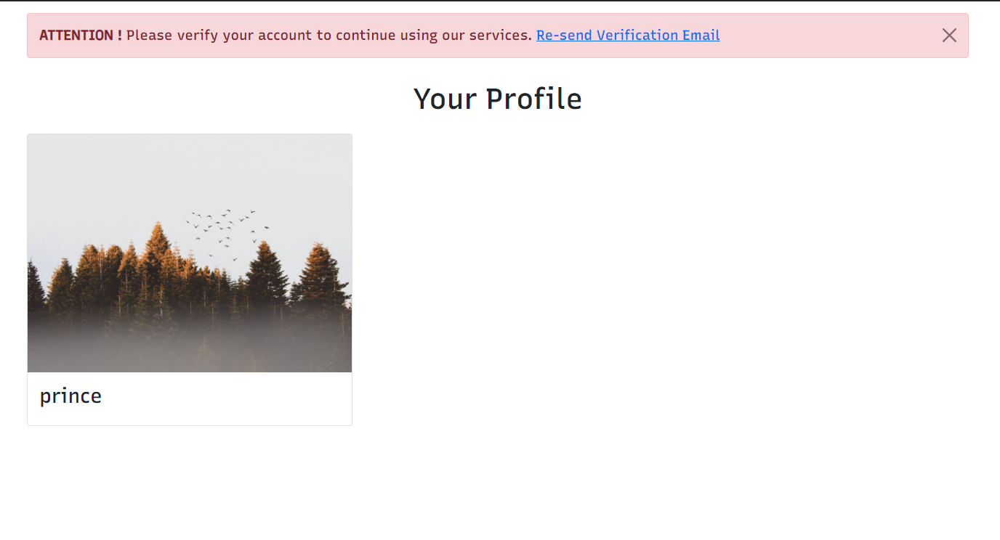

# Node Passport Authentication

## 1. USAGE

### Install All Packages

```bash
npm install express ejs mongoose bcryptjs connect-flash cookie-parser express-session csurf memorystore passport passport-local passport-google-oauth20 nodemailer
```

### Install Nodemon For Development

```bash
npm install -D nodemon
```

### Add mongoURI ,Google client ID and Secret, smtp config for sending emails
### And Feel free to delete the screenshots directory

# Added Options






# Todo ( ✔ -> Done )

✔ Add User Password rest
✔ Add Verify Account
✔ Add Email Sending Options
✔ Added Flash messages for errors


# nodejs_authentication
